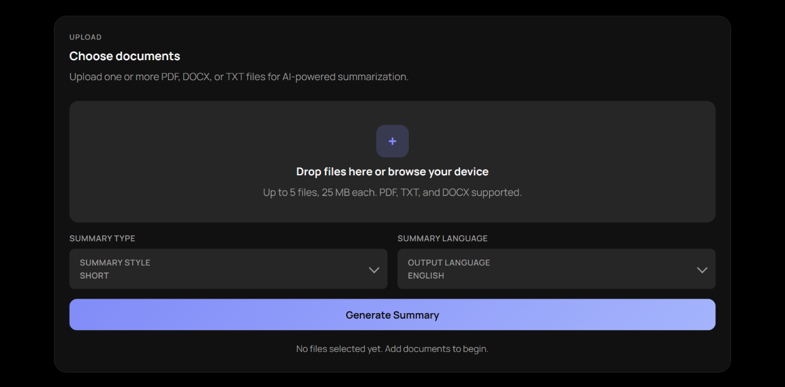
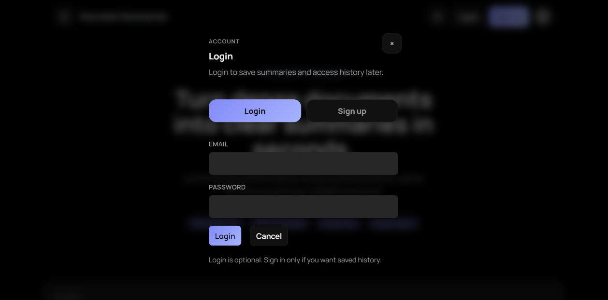
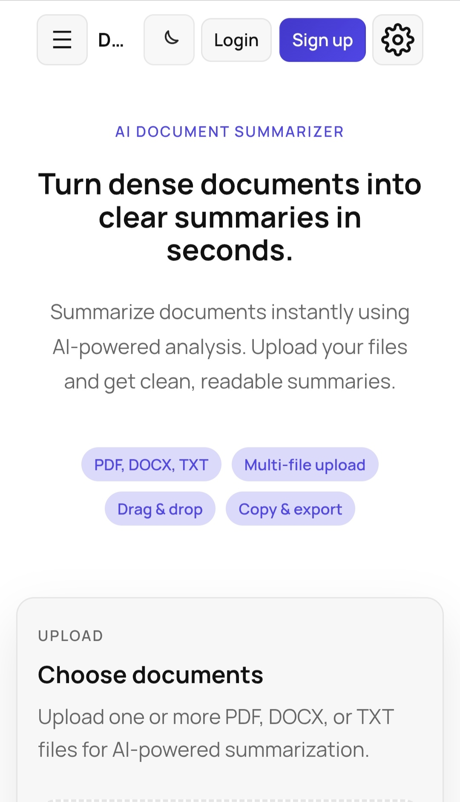
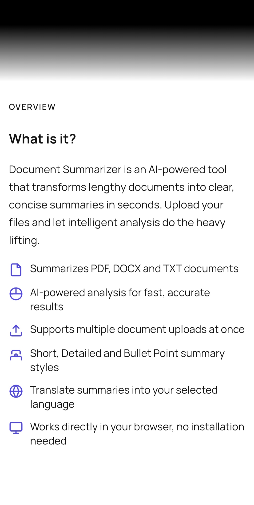

# AI Document Summarizer

An AI-powered web application that converts PDF, TXT, and DOCX files into clean, readable summaries within seconds.

## Live Link

https://ai-document-summariser-j4a7.onrender.com

---

## Important

This project requires your own:

- Firebase configuration
- Gemini API key

Environment variables are not included for security reasons.

## Features

- Upload PDF, TXT, and DOCX documents
- Generate AI-powered summaries
- Multiple summary styles:
  - Short
  - Detailed
  - Bullet Points
- Multi-file upload support
- Save summary history with authentication
- Responsive UI for:
  - Mobile
  - Tablet
  - Desktop
- Dark / Light mode
- Copy and download summaries

---

## Tech Stack

### Frontend
- HTML
- CSS
- JavaScript

### Backend
- Node.js
- Express.js

### Database & Authentication
- Firebase Authentication
- Firestore Database

### AI
- Gemini API

### Deployment
- Render

---

## Screenshots

### Homepage


### Upload Interface


### Generated Summary


### Mobile View



---

## Installation

## Local Setup

### 1. Clone the repository

```bash
git clone https://github.com/YOUR_GITHUB_USERNAME/YOUR_REPOSITORY_NAME.git
cd YOUR_REPOSITORY_NAME
```

---

## Backend Setup

### 2. Navigate to backend

```bash
cd backend
```

### 3. Install dependencies

```bash
npm install
```

### 4. Create `.env`

Create a `.env` file inside the backend folder and add:

```env
PORT=3000

GEMINI_API_KEY=your_api_key
COHERE_API_KEY=your_api_key (Optional)
HUGGINGFACE_API_KEY=your_api_key (Optional)

GEMINI_KEY_ENCRYPTION_SECRET=your_encryption_secret_here

WEB3FORMS_ACCESS_KEY=your_web3forms_access_key

FIREBASE_PROJECT_ID=your_project_id
FIREBASE_CLIENT_EMAIL=your_client_email
FIREBASE_PRIVATE_KEY=your_private_key

# Contact form delivery (Web3Forms). Create a form at https://web3forms.com to
# get your access key. It is a public key (safe to expose) and not secret.
WEB3FORMS_ACCESS_KEY=your_web3forms_access_key
```

### 5. Start backend server

```bash
npm start
```

Backend will run on:

```txt
http://localhost:3000
```

---

## Frontend Setup

The frontend is built with HTML, CSS, and JavaScript.
So you can open the project root in your code editor and run the frontend using a local development server.

### 6. Firebase Configuration

The application uses Firebase Authentication.
Therefore it requires the following Firebase Configuration :

FIREBASE_API_KEY=your_key
FIREBASE_AUTH_DOMAIN=your_domain
FIREBASE_PROJECT_ID=your_project_id
FIREBASE_STORAGE_BUCKET=your_bucket
FIREBASE_MESSAGING_SENDER_ID=your_sender_id
FIREBASE_APP_ID=your_app_id
```

> Note:
> The backend is hosted on Render free tier, so the first request after inactivity may take a few seconds.
